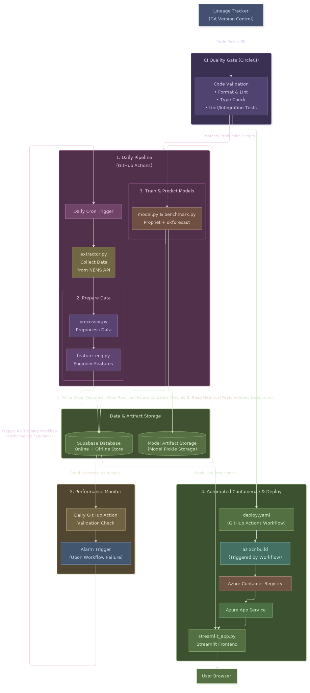

# Singapore Energy Demand Forecasting with ML Pipeline and Azure Deployment

## Project Overview
This project forecasts Singapore's electrical energy demand by combining Meta's Prophet time-series forecasting with skforecast (LightGBM + ExtraTrees) and rigorous model benchmarking against baseline models. The system pulls live market data from the Singapore NEMS API, engineers time-series features, predicts future demand, and automatically selects the best-performing model based on Mean Absolute Error (MAE).

Live preview: [App](Add link here)

- All model initial evaluation results can be found in `tools > Data Analysis and Model training.ipynb`

**How It Works in This Project:**

- Input: 30-min interval energy data (demand, solar generation, uniform energy price) from Singapore NEMS API.
- Models:
    - Prophet (univariate with solar + USEP regressors and Singapore holidays).
    - skforecast / LightGBM / ExtraTrees (recursive multi-step forecasters).
    - 4 baseline models.
- Output: Energy demand forecasts with best model selection based on MAE benchmarking, saved to Supabase.
- Training: Models fit on accumulated historical data (minimum 6 months of 30-min interval data required).

---
## Mermaid Flowchart diagram



- [Visual Flowchart](tools/EF.mp4) Preview

#### Prophet Model
- A time-series forecasting library by Meta.
- Uses additive seasonality (weekly + daily) with exogenous regressors for solar generation and uniform energy price.
- Incorporates Singapore public holidays with ±1 day windows for holiday effects.
- In this project, Prophet runs as a single model on the full demand time series.

#### skforecast (LightGBM + ExtraTrees)
- A recursive forecasting library that wraps sklearn-compatible regressors for time-series tasks.
- Uses configurable lag features (1, 2, 48, 96, 336 periods) for autoregressive input.
- Also incorporates calendar features (hour, day-of-week, weekend), cyclical hour encoding, rolling statistics (24h avg/std, 7d avg), and exogenous variables (solar, USEP).
- LightGBM and ExtraTrees each provide a second opinion alongside Prophet.

#### Model Benchmarking
- Every model is benchmarked against simple baseline models using walk-forward MAE evaluation.

**Baseline Models:**

| Model | Description |
| :--- | :--- |
| Last Value | Predicts next demand as the most recent observation (lag_2) |
| Yesterday Same Time | Predicts using demand from 24 hours ago (lag_48) |
| Last Week Same Time | Predicts using demand from 7 days ago (lag_336) |
| Avg Demand 24h | Predicts as the rolling mean of the last 24 hours |

**ML Models:**

| Model | Description |
| :--- | :--- |
| Prophet | Univariate with solar + USEP regressors + Singapore holidays |
| LightGBM | Gradient-boosted trees with recursive skforecast wrapper |
| ExtraTrees | Randomised extra-trees ensemble with recursive skforecast wrapper |

**Best Model Selection:**
The model (ML or baseline) with the lowest MAE on the test set is selected as the best model for that forecast period.

---
### Feature Engineering

The feature engineering pipeline (`engineer_features` in `src/feature_eng.py`) builds the following from raw 30-min demand data:

| Category | Features |
| :--- | :--- |
| Calendar | hour, minute, day_of_week, day_of_month, month, quarter, is_weekend |
| Cyclical | hour_sin, hour_cos (circular encoding) |
| Lags | lag_1, lag_2, lag_48, lag_96, lag_336 (demand shifts) |
| Rolling | demand_avg_24h, demand_std_24h, demand_avg_7d |
| Exogenous | solar_lag_1, usep_lag_1 (solar / USEP shifts) |
| Raw | solar, usep (kept as-is) |

---

## Installation

### Standard Installation

```bash
make install
```

### Requirements

- [Python 3.13+](https://www.python.org/downloads/)

- [uv](https://docs.astral.sh/uv/)
    - `pip install uv` > `uv sync` (installs main dependencies) > `uv sync --extra dev` (installs `ruff`, `mypy`, `pytest`)

| Action | Old Way (Pip + Venv) | Modern Way (uv) |
| :--- | :--- | :--- |
| Install a package | pip install numpy (then manually save to text) | uv add numpy |
| Install project code | pip install -r requirements.txt | uv sync |
| Run your script | source .venv/bin/activate then python main.py | uv run python main.py |

- [CircleCI account](https://circleci.com/blog/setting-up-continuous-integration-with-github/)
    - Used for checking code quality by running linting (`ruff`), type checking (`mypy`), and unit tests (`pytest`).

- [Supabase account](https://supabase.com/docs/guides/getting-started)
    - Used for storing daily energy demand forecast data in a Postgres table.

### Environment Variables

Copy & edit `.env.example` to `.env` and fill in your keys:

```bash
SUPABASE_URL=https://your-project.supabase.co
SUPABASE_KEY=your-service-role-key
```

## Usage

### How to run this program:
1. `make run` or `uv run python -m src.main`
2. `make dashboard` or `uv run streamlit run src/streamlit_app.py`

### Other commands:
- `make lint` — run ruff linter + format check
- `make format` — auto-fix lint issues + format code
- `make type-check` — run mypy type checker
- `make test` — run unit tests (skips live API smoke tests)
- `make install` — install all dependencies
- `make acr-build` — show Azure CLI commands for cloud build

---

## Deployment

The Streamlit dashboard is containerized and deployed on Azure App Service (F1) using Azure Container Registry.

Deploys are automated via GitHub Actions — every `git push` to `main` triggers `.github/workflows/deploy.yml` to build a new image in ACR and restart the App Service.

### CI/CD — Automatic Deploy on Push

The workflow in `.github/workflows/deploy.yml` runs on every push to `main`:

1. **Login** to Azure via service principal
2. **Build & push** image using `az acr build` (no local Docker needed)
3. **Restart** the App Service to pull the latest image

**To enable this, configure these GitHub secrets/vars:**

| Secret / Var | Value | How to get it |
|---|---|---|
| `AZURE_CREDENTIALS` | Service principal JSON | `az ad sp create-for-rbac --name "github-deploy" --role contributor --scopes /subscriptions/3cec7872-315a-4ffd-9fe4-40841e39d418/resourceGroups/energy-forecast-rg --sdk-auth` |
| `AZURE_APP_SERVICE_NAME` (var) | Your App Service name | Name you chose when creating the App Service |

### One-Time Azure Setup

```bash
# 1. Resource group + ACR (already done)
az group create --name energy-forecast-rg --location southeastasia
az acr create --resource-group energy-forecast-rg --name energyforecastacr --sku Basic --admin-enabled true

# 2. Create App Service (Linux, F1 Free) in the Azure Portal
#    - Publish: Docker Container
#    - Region: Southeast Asia
#    - SKU: Free F1
#    - Image: energyforecastacr.azurecr.io/demand-forecast-app:latest
#    - Startup command: uv run streamlit run src/streamlit_app.py --server.port 8000

# 3. Set env vars in App Service → Settings → Environment variables:
#    SUPABASE_URL, SUPABASE_KEY
```

### Manual Cloud Build (if needed)

```bash
# Azure Cloud Shell (no install needed)
az acr build --registry energyforecastacr --image demand-forecast-app:latest .
az webapp restart --name <your-app-name> --resource-group energy-forecast-rg
```

> **Note:** The F1 Free tier supports container deployments via ACR integration. For custom container support, upgrade to B1+.

---

#### This project can be edited in `src/settings.py`
- Adjust `FEATURE_COLS` to add/remove which features the ML models receive.
- Tune `PROPHET_PARAMS`, `LGBM_PARAMS`, `ET_PARAMS` for model behaviour.
- Set `SKFORECAST_LAGS` to change the autoregressive lag window.
- Set the time to run daily in `.github/workflows/daily-forecast.yml`
    - The GitHub Actions cron job runs automatically every day at 17:00 UTC (1:00 AM SGT).
